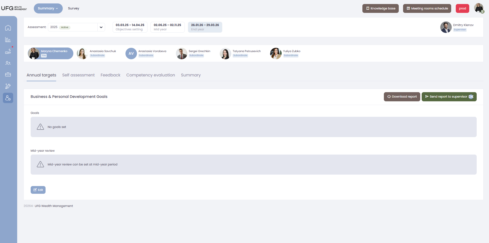

## User Prompt

Here is how user performance development page looks like.

We need a resonable way to download user's reports:

1. Admins should be able to download all reports (annual targets, self assessments, feedback, competency evaluation) for every user in the system.
2. Supervisors or mentors should be able to download all reports (annual targets, self assessments, feedback, competency evaluation) for every mentee or subordinate that they have.
3. There should be a way to limit / restrict which reports supervisors or mentors have access to. Let's say we only want to allow mentors and supervisors to download self assessments and feedback reports.
4. There should be bulk download option (select users from specific company: Altus Capital, Family Office, etc), select all / certain users and download all reports as zip archive.

Can you suggest a page design (or several pages, for example one for admins and supervisors / mentors and one for rights configuration) that would fit this criteria?

---

## UI Research

### Module
Assessment 360 — Performance Development

### Reference Page
- **Path:** src/pages/assessment360/pdp360/containers/Pdp360Page.tsx
- **Layout:** Tabbed detail page with role-based access control
- **Components used:** TabsContainer/Tab, Dropdown, Button, LinkButton, Card, Alert, Labels, RadioButtons, Modal, Popover
- **Patterns noted:**
  - Multiple tabs: Annual targets, Self assessment, Feedback, Competency evaluation, Summary
  - User selection via RadioButtons with avatar chips showing role (You, Supervisor, Mentor, Subordinate)
  - Assessment period selector dropdown with Active/Inactive status labels
  - Permission-based tab visibility — supervisors see restricted view
  - SendToMentorButton with Popover showing mentor/supervisor info

### Similar Patterns
- Single report download with filtered query string — `src/pages/assessment360/assessmentProgressReport/containers/AssessmentProgressReportPage.tsx`
- Bulk ZIP download with filter-based filename — `src/pages/invoice/containers/InvoicePage.tsx`
- Staff list download with company/department filters — `src/pages/hrs/staff/containers/StaffPage.tsx`
- Table row selection with checkboxes for bulk operations — `src/components/Table/RowSelectColumn.tsx` (`useRowSelectColumn` hook)

### Components Needed
- **LinkButton** — `src/components/Link`
- **Modal / ModalContext** — `src/components/Modal`
- **Dropdown** (isMulti) — `src/components/Dropdown`
- **Checkbox** — `src/components/Checkbox`
- **AdminPage / AdminTable / AdminFilterRow** — `src/components/AdminPage`
- **FilterSelect** (isMulti) — `src/components/Filter`
- **FilterAutocomplete** — `src/components/Filter`
- **Label** — `src/components/Labels`
- **Alert** — `src/components/Alert`
- **AppLayout** — `src/components/Layout`

### Image Observations
- Page header: Assessment dropdown (e.g. "2025 Active"), three date range indicators (Objectives setting, Mid year, End year) — active period highlighted
- User selection strip: avatar chips with name and role labels ("You", "Subordinate") — allows switching whose data is viewed
- Tab navigation: Annual targets | Self assessment | Feedback | Competency evaluation | Summary
- Card content area with "Business & Personal Development Goals" title, "Download report" (dark) and "Send report to supervisor" (green) buttons top right
- Empty state: warning triangle icon inside light grey rounded panel
- Edit button (outlined small) at bottom left of card
