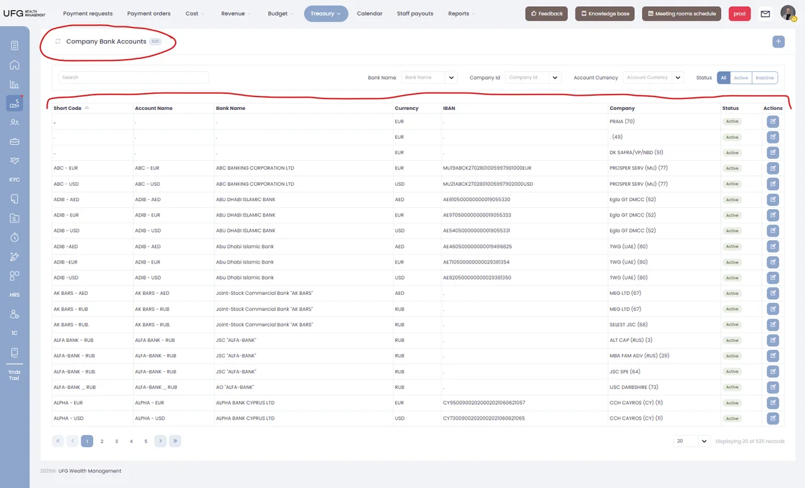
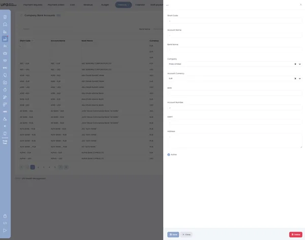

## User Prompt

On the company bank accounts page following changes are proposed:

1. Rename Company Bank Fccounts → Internal Company Bank Accounts (header, nav menu title, where applicable)
2. Add account number field
3. Render company name value in company column (now shows company short code)
4. Adjust column order: 1) Company (renders company name), 2) Company Code (renders company short code), 3) Bank name, 4) Account name, 5) Account short code, 6) Account currency, 7) Account number, 8) IBAN, 9) Status, 10) Actions.

On the company bank account form page following changes are proposed:

1. Add new field - Correspondent account
2. Change field order: 1) Company, 2) Bank name, 3) Account name, 4) Short code, 5) Account currency, 6) Account number, 7) Correspondent account number, 8) IBAN, 9) SWIFT, 10) Address, 11) Active flag
3. Instead of having active flag (which just reflects account state), we need a way to indicate several states that can happen to bank account: 1) account termination (with termination date and notes), 2) account suspension / block (with block date and notes), 3) account suspension lifted / block removed.

---

## UI Research

### Module
`treasury/companyBank`

### Reference Page
- **Path:** `src/pages/treasury/companyBank/containers/CompanyBankPage.tsx`
- **Layout:** AdminPage with table and modal form
- **Components used:** AdminPage, AdminTable, AdminForm, Label, formText, formTextarea, formAutocomplete, formCheckbox, FilterRadioButtons
- **Patterns noted:**
  - TABLE_CONFIG array with `TableColumn<T>[]` defining columns with Header and Cell properties
  - FORM_CONFIG array with `FormFieldConfig<T>[]` with key, label, widget, validate
  - FILTER_CONFIG with search, select dropdowns, and radio button filters
  - `formAutocomplete` for entity references (company, currency)
  - `Label` component with variant (success/danger) for status display
  - Custom Cell renderer using `props.row.original` and `props.value`
  - `toSubmitBody()` transforms form data before API submission
  - `formatModalTitle()` formats modal header with shortCode + accountName

### Similar Patterns
- VendorBank page (nearly identical structure, already has `corrAccountNumber`, `corrBankName`, `corrBankSwift`) — `src/pages/treasury/vendorBank/containers/VendorBankPage.tsx`
- BudgetLineCategory page uses `FilterRadioButtons` for multi-option filtering — `src/pages/admin/budgetLineCategory/containers/BudgetLineCategoryPage.tsx`

### Components Needed
- **AdminPage, AdminTable, AdminForm** — `src/components/AdminPage`
- **Label** — `src/components/Labels/Label.tsx`
- **formText, formTextarea, formAutocomplete** — `src/components/Form/Widgets`
- **formSelect** — `src/components/Form/Widgets/FormSelect.tsx`
- **RadioButtons** — `src/components/Radio`
- **FilterRadioButtons** — `src/components/Filter`
- **Table, TableColumn** — `src/components/Table/types.ts`

### Image Observations
- **Image 1 (List page):** Header "Company Bank Accounts". Columns: Short Code, Account Name, Bank Name, Currency, IBAN, Company, Status, Actions. Status uses Label component (green=Active, red=Inactive). Company column shows company name with ID in parentheses. Filters: search, Bank Name dropdown, Company ID dropdown, Currency dropdown, Status radio (All/Active/Inactive). 20 of 525 records shown. Account Number column is absent.
- **Image 2 (Form page):** Modal form. Visible fields: Short Code, Account Name, Bank Name, Company (autocomplete), Account Currency (autocomplete), Address (textarea), SWIFT, Account Number. Single-column layout. Save/Close at bottom. Active flag as checkbox. Correspondent account field absent. Field order needs resequencing.
