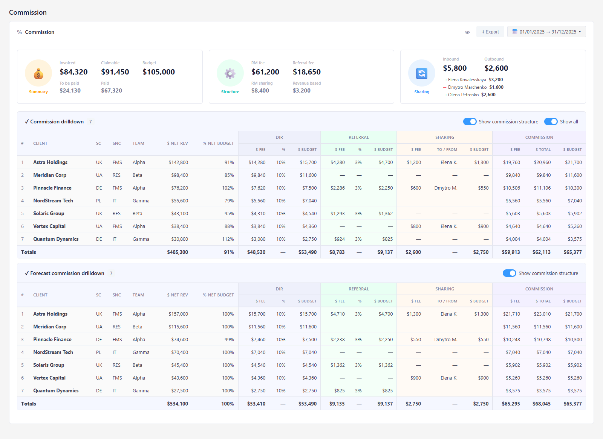
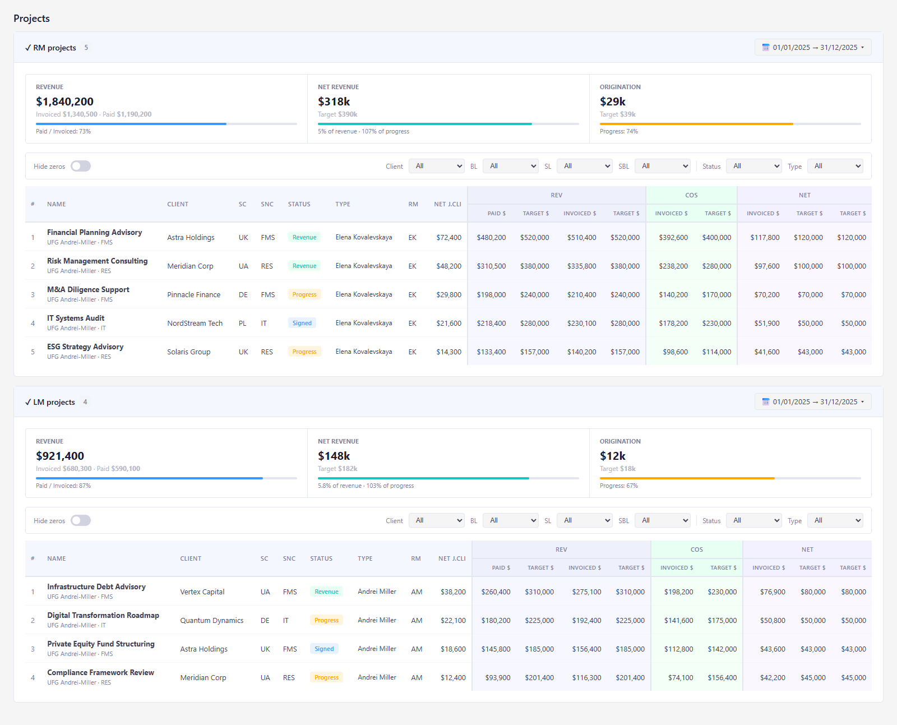

## User Prompt

1. Separate Commission dashboard page (with all data shown / expanded by default)
2. Extract projects to separate dashboard page

---

## UI Research

### Module
Dashboard / RM

### Reference Page
- **Path:** src/pages/dashboard/rmDashboard/containers/RmDashboard.tsx
- **Layout:** full-page dashboard with multiple collapsible cards
- **Components used:** AppLayout, Commissions, RmProjects, LmProjects, CommissionDashboard, ProjectDashboard, Card
- **Patterns noted:**
  - AppLayout with `hasYearSelect` + `hasToggler`
  - UserTogglerContext for user switching
  - Feature guards per section (FEATURE.dashboard.rm / .lm / .commissions)
  - IntervalPicker in card toolbar
  - CommissionVisibilityContext hides/shows dollar amounts
  - DrilldownTable cards are collapsible; `showAll` defaults to `false` — dedicated page should default to `true`

### Components Needed
- AppLayout, Card/CardToolbar, Feature/Forbidden, ScrollTop
- UserTogglerContext / useUserTogglerState
- IntervalPicker / useIntervalPickerState
- CommissionDashboard component, CommissionVisibilityContext, CommissionExportButton
- Commissions container, RmProjects, LmProjects

### Image Observations
- Commission card: interval picker + eye toggle + export button in toolbar
- Three circular stat widgets: Summary (yellow), Structure (green), Sharing (blue)
- Commission drilldown: collapsible secondary card, Show commission structure + Show all togglers
- Forecast commission drilldown: same layout
- RM projects: Revenue / Net Revenue / Origination stats + project table
- LM projects: same layout below RM projects
- "All expanded by default" = cards not collapsed, showAll=true

---

## Revision 1

The current RM dashboard page combines commission data and project data in one view. This design separates them into two dedicated pages: a Commission Dashboard (stats + drilldowns fully expanded by default) and a Projects Dashboard (RM and LM projects only).

[Open mockup](03-r1-mockup-commission-dashboard.html)

[Open mockup](03-r1-mockup-projects-dashboard.html)

### Layout Notes

- Entry point for the Commission Dashboard: new menu item under Financial alongside existing "RM" entry
- The existing "RM" menu item will show only projects — no commission section
- Both "Commission drilldown" and "Forecast commission drilldown" tables are expanded by default with Show all enabled
- "Show commission structure" is on by default showing Dir / Referral / Sharing / Commission column groups
- Visibility toggle (eye icon) hides dollar amounts — same existing behaviour
- RM Projects and LM Projects have independent date range pickers in their card headers
- User switcher (toggler) available on both pages for managers viewing other users' data
- Both pages require appropriate feature permissions (commissions / rm / lm)
