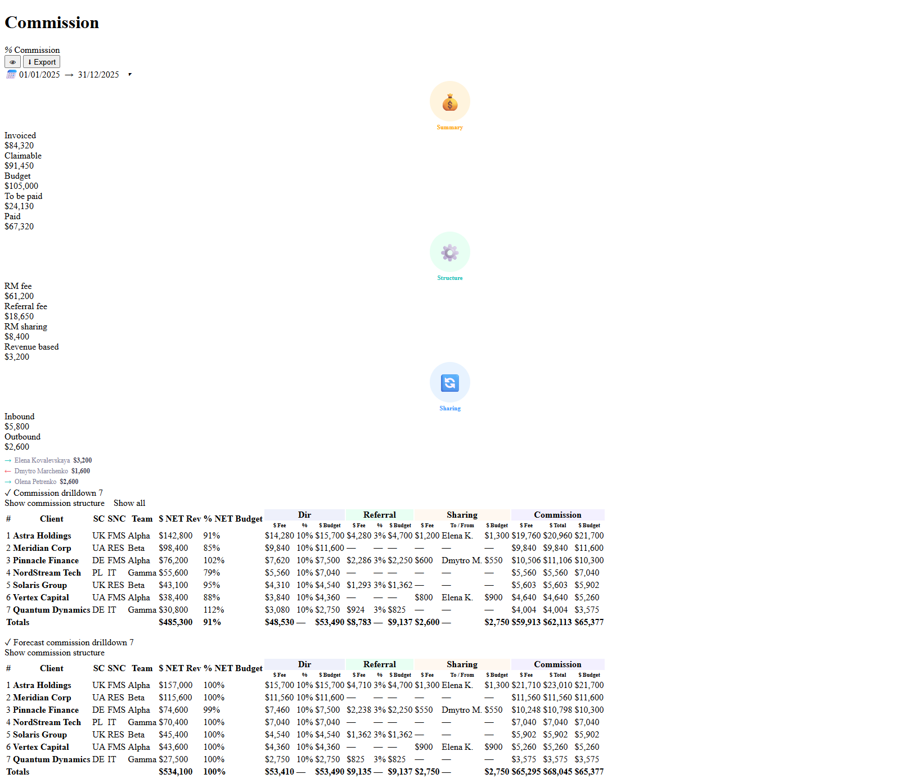
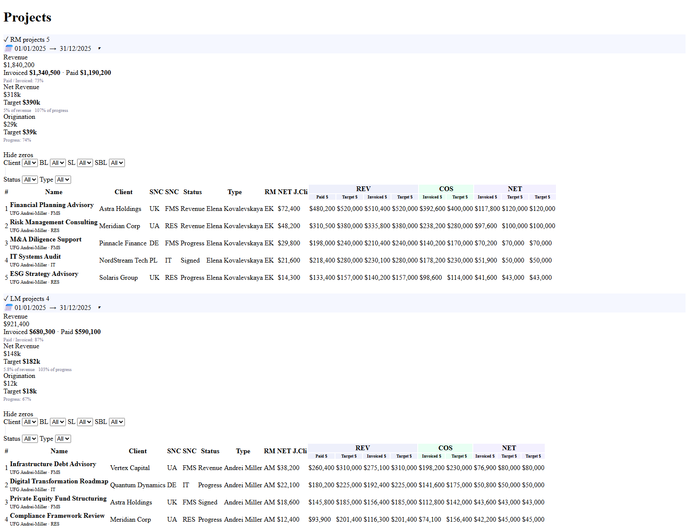

## User Prompt

1. Separate Commission dashboard page (with all data shown / expanded by default)
2. Extract projects to separate dashboard page

---

## UI Research

### Module
Dashboard / RM

### Reference Page
- **Path:** src/pages/dashboard/rmDashboard/containers/RmDashboard.tsx
- **Layout:** full-page dashboard with multiple collapsible cards
- **Components used:** AppLayout, Commissions (container), RmProjects, LmProjects, CommissionDashboard (component), ProjectDashboard, Card
- **Patterns noted:**
  - AppLayout with `hasYearSelect` + `hasToggler` props
  - UserTogglerContext for user switching
  - Feature guards per section (FEATURE.dashboard.rm / .lm / .commissions)
  - Interval picker (IntervalPicker) in card toolbar
  - CommissionVisibilityContext wraps commission card to hide/show dollar amounts
  - DrilldownTable cards use `collapsible` prop on Card — collapsed state is user-controlled
  - `showDetails` ("Show commission structure") defaults to `true` in CommissionDashboard
  - `showAll` ("Show all") defaults to `false` — the dedicated page should default this to `true`

### Similar Patterns
- Personal business line dashboard (sub-view split from combined page) — `src/pages/dashboard/businessLineDashboardPersonal/`
- CommissionDashboard personal page — `src/pages/dashboard/commissionsDashboard/containers/CommissionDashboard.tsx`

### Components Needed
- **AppLayout** — `src/components/Layout`
- **Card / CardToolbar** — `src/components/Card`
- **Feature / Forbidden** — `src/features`, `src/components/Errors`
- **ScrollTop** — `src/components/ScrollTop`
- **UserTogglerContext / useUserTogglerState** — `src/pages/global/UserToggler`
- **IntervalPicker / useIntervalPickerState** — `src/components/Date/IntervalPicker`
- **CommissionDashboard (component)** — `src/pages/dashboard/rmDashboard/components/CommissionDashboard.tsx`
- **CommissionVisibilityContext / CommissionsVisibilityButton** — `src/pages/dashboard/rmDashboard/components/CommissionVisibilityContext.tsx`
- **CommissionExportButton** — `src/pages/dashboard/rmDashboard/components/CommissionExportButton.tsx`
- **Commissions (container)** — `src/pages/dashboard/rmDashboard/containers/Commissions.tsx`
- **RmProjects / LmProjects** — `src/pages/dashboard/rmDashboard/containers/`

### Image Observations
- Page has a top-level "Commission" card with an interval date-range picker in the toolbar (top-right)
- Commission card toolbar also has a visibility toggle (eye icon) and export button
- Inside Commission card: three circular stats widgets in a row — Summary (yellow), Structure (green), Sharing (blue)
- Below the stats: "Commission drilldown" secondary card — collapsible, with "Show commission structure" and "Show all" togglers
- Below that: "Forecast commission drilldown" secondary card — collapsible, same togglers
- Below Commission card: "RM projects" section with Revenue / Net Revenue / Origination stat widgets and a detailed project table
- Below RM projects: "LM projects" section with the same layout
- "All data shown / expanded by default" means: DrilldownTable cards not collapsed, `showAll=true` by default

### Proposed Split
**Commission page** (`/dashboard/rm/commissions`): shows only the Commission section (stats + drilldowns) with `showAll=true` by default and DrilldownTable cards non-collapsible or expanded.

**Projects page** (existing `/dashboard/rm` route or new `/dashboard/rm/projects`): shows only RmProjects + LmProjects.

---

## Revision 1

The current RM dashboard page combines commission data and project data in one view. This design separates them into two dedicated pages: (1) a Commission Dashboard with all commission stats and drilldown tables expanded by default, and (2) a Projects Dashboard showing only RM and LM project sections.

[Open mockup](03-r1-mockup-commission-dashboard.html)

[Open mockup](03-r1-mockup-projects-dashboard.html)

### Layout Notes

- Entry point for the Commission Dashboard: a new menu item under Financial (e.g. "RM Commissions") alongside the existing "RM" entry
- The existing "RM" menu item (/dashboard/rm) will show only projects — no commission section
- On the Commission Dashboard, both "Commission drilldown" and "Forecast commission drilldown" tables are expanded by default with Show all enabled
- The "Show commission structure" toggle is on by default, showing Dir / Referral / Sharing / Commission column groups
- The visibility toggle (eye icon) hides dollar amounts — same existing behavior
- On the Projects Dashboard, RM Projects and LM Projects have independent date range pickers in their card headers
- The user switcher (toggler) is available on both pages for managers viewing other users' data
- Both pages require appropriate feature permissions (commissions for Commission page; rm/lm for Projects page)
